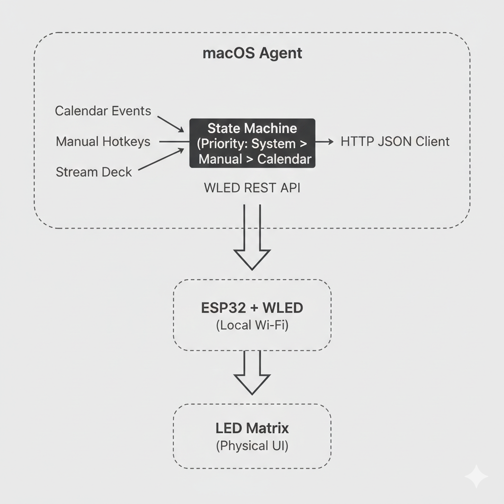

# 💡 BusyLight

<!-- Badges -->
[](https://www.apple.com/macos/)
[](https://www.espressif.com/en/products/socs/esp32)
[](https://github.com/wled/WLED)
[](LICENSE)
[](https://github.com/dralquinta/busy-light/releases)
[](https://github.com/dralquinta/busy-light/commits)
[](https://github.com/dralquinta/busy-light)

---

## The Story Behind BusyLight

Working from home is wonderful — until it isn't.

You're mid-meeting, presenting to a client or deep in a focused coding session, when a family member walks in to ask something that could have waited. Or worse, a child bursts in during a video call because they had no way of knowing you were busy.

The problem is not that your family doesn't care. The problem is that **software presence indicators are invisible to the physical world**. Your calendar knows you're in a meeting. Your colleagues know from Slack or Teams. But the people sharing your home have no signal.

**BusyLight solves this with a physical, always-visible presence light.**

A small, self-contained Wi-Fi LED device sits anywhere in your home — on your desk, outside your office door, or on a shelf in the hallway. It glows green when you're available, yellow when tentative, red when you're busy or in a meeting, and turns off when you step away. No apps to check. No screens to glance at. Just a clear, unmistakable signal that everyone in your household instantly understands.

### What Makes This Different

- **Automatic**: Your macOS calendar drives the light — no manual intervention needed during meetings.
- **Overridable**: Stream Deck buttons or global hotkeys let you instantly override the state when needed.
- **Local-first**: Everything runs on your home network. No cloud accounts, no subscriptions, no privacy tradeoffs.
- **Open hardware**: The device is built on ESP32 and WLED — fully documented, hackable, and community-supported.
- **Open software**: The macOS agent is written in Swift and is fully open-source.

### The Philosophy

This project exists because presence awareness at home should be:

- **Transparent** — visible at a glance, without requiring anyone to look at a screen.
- **Automatic** — driven by your actual schedule, not by remembering to flip a switch.
- **Respectful** — a gentle, non-intrusive signal that creates better boundaries without tension.
- **Private** — your calendar data stays on your machine. The light communicates over your local network only.

---

## Understanding the Hardware Layer (WLED and ESP32)

BusyLight's physical device is powered by **[WLED](https://github.com/wled/WLED)**, an open-source LED control firmware for ESP32 microcontrollers.

### Why WLED?

WLED is the de facto standard for addressable LED control in the DIY community. It offers:

- A full HTTP JSON API for remote control — exactly what this project uses to send presence state from macOS.
- Built-in support for presets, animations, and color palettes — used to represent each presence state visually.
- A web-based configuration UI accessible from any browser on your network.
- Active community support and a comprehensive documentation ecosystem.
- Support for a wide range of ESP32 boards and LED strips/matrices.

### How WLED Fits In

This project **does not replace WLED** — it builds on top of it.

```
macOS Agent  ──(HTTP JSON)──►  WLED (ESP32)  ──►  LED Matrix / Strip
```

The macOS agent reads your calendar, resolves your current presence state, and sends a command to WLED's REST API. WLED handles all the hardware communication, pixel rendering, animations, and preset management. The agent simply tells WLED which preset to activate.

### Before You Build the Device

You **must** read the official WLED documentation before attempting to build or configure the hardware:

- 📖 **WLED GitHub**: [https://github.com/wled/WLED](https://github.com/wled/WLED)
- 🔧 **WLED Web Installer**: [https://install.wled.me/](https://install.wled.me/)

Key WLED topics you will need to understand:

| Topic | Why It Matters |
|-------|----------------|
| Firmware installation via web installer | Flashing WLED onto your ESP32 board |
| Hardware pin configuration | Connecting your LED strip to the correct GPIO pin |
| Matrix/strip setup | Configuring the number of pixels and their layout |
| Presets | Defining colors and animations for each presence state |
| JSON API | How the macOS agent communicates with the device |

> **Important**: The hardware documentation in `specs/` describes the physical enclosure and wiring. WLED firmware installation and configuration is handled entirely through the official WLED tools linked above.

---

## Architecture Overview





---

## Project Structure

- **`specs/`** — Hardware specifications and requirements
- **`macos-agent/`** — macOS menu bar application (Swift + AppKit)
  - See [macos-agent/README.md](macos-agent/README.md) for build, run, and architecture details
- **`docs/`** — Extended documentation and GitHub Pages site

---

## Quick Start (macOS Agent)

```bash
cd macos-agent
xcodebuild -scheme BusyLight
```

The application will launch and display an icon in your menu bar. See [macos-agent/README.md](macos-agent/README.md) for full instructions.

## Hotkeys (Hardcoded)

BusyLight responds to global keyboard shortcuts for quick status changes:

| Hotkey | Action |
|--------|--------|
| **Ctrl+Cmd+1** | Mark as Available |
| **Ctrl+Cmd+2** | Mark as Tentative |
| **Ctrl+Cmd+3** | Mark as Busy |
| **Ctrl+Cmd+4** | Resume Calendar Control (cancel override) |
| **Ctrl+Cmd+5** | Turn Off |
| **Ctrl+Cmd+6** | Mark as Away |

These hotkeys work globally and require Accessibility permission (see below). Manual overrides (Ctrl+Cmd+1/2/3/6) persist for 30 minutes before returning to calendar-based status, unless **Ctrl+Cmd+4** is pressed to immediately resume calendar control. **Ctrl+Cmd+5** turns off the app immediately.

See [docs/hotkey.md](docs/hotkey.md) for complete documentation and permission setup.

## Required Permissions

BusyLight requires two permissions to function:

### 1. Accessibility Permission (for Global Hotkeys)

Required for detecting keyboard shortcuts (Ctrl+Cmd+1/2/3/4/5/6) system-wide.

**To grant:**
1. Open **System Settings → Privacy & Security → Accessibility**
2. Click the **+** button
3. Navigate to and select `BusyLight.app` (in `/Applications` or build output)
4. Toggle **ON** (ensure checkmark is visible)
5. Restart the App

### 2. Calendar Permission (for Status Sync)

Required for reading your calendar events to determine availability.

**To grant:**
1. Open **System Settings → Privacy & Security → Calendars**
2. Find "BusyLight" in the list
3. Toggle **ON**

## First-Launch Setup

After building or updating the code:

1. **Remove old Accessibility registration** (System Settings → Privacy & Security → Accessibility):
   - Find "BusyLight" in the list
   - Click it, then click the **minus (−)** button
2. **Build the app**: `./build.sh`
3. **Open the app**: `open BusyLight.app` or `./debug.sh`
4. **Grant Accessibility permission** when prompted
5. **Grant Calendar permission** if prompted
6. **Close the app** completely (`Cmd+Q`)
7. **Reopen the app**: `open BusyLight.app`
8. **Status should sync** to your current calendar availability

The permission reset is required because new app builds have different code signatures, and macOS's accessibility database needs to re-validate the app. This is a one-time setup per build.

**Note**: If upgrading from an older version that used F13-F17 function keys for hotkeys, the app will automatically migrate them to Ctrl+Cmd combinations on first launch.

## Documentation

### GitHub Pages Site

Visit the full documentation site (coming soon via GitHub Pages).

### Architecture & Design
- **[macOS Presence Agent — Menu Bar Skeleton](docs/macOS-presence-agent-menuskeleton.md)** — Complete implementation guide, architecture, build workflow, concurrency design, and testing strategy (February 2026)
- **[State Machine Architecture](docs/state-machine.md)** — Hierarchical state machine coordinating presence across calendar, manual overrides, and system events. Modes, transitions, priority rules, and configuration options.
- **[Architecture Overview](docs/architecture.md)** — System architecture, component breakdown, and communication protocols
- **[WLED WLAN Support](docs/wled-wlan-support.md)** — Comprehensive technical documentation for the WLED HTTP communication layer: NetworkClient, HTTPAdapter, DeviceDiscovery, multi-device broadcasting, and concurrency design

### Integration Guides
- **[EventKit Calendar Integration](docs/eventkit-calendar-integration.md)** — Calendar event scanning, permission handling, and availability resolution logic
- **[Global Hotkey Integration](docs/hotkey.md)** — Keyboard shortcuts for quick status changes (Ctrl+Cmd+1/2/3 for states plus Ctrl+Cmd+4 to resume calendar), F16/F17, override behavior, permission setup, and troubleshooting
- **[Hardware Layer (WLED & ESP32)](docs/hardware.md)** — ESP32 setup, WLED installation, wiring, and device configuration
- **[Software Layer (macOS Agent)](docs/software.md)** — Calendar integration, state management, hotkeys, and WLED communication
- **[Network Integration (WLED)](macos-agent/network/README.md)** — HTTP JSON API, Bonjour discovery, multi-device, health monitoring

### Hardware & Testing
- **[Hardware Module Assembly](docs/module-assembly.md)** — Step-by-step wiring guide, bill of materials, enclosure assembly
- **[WLED Network Module Testing](docs/module-testing.md)** — 12 test cases covering all 6 presence states, resilience, multi-device, and discovery

## Design Philosophy

- **Minimal & Focused**: Single-purpose presence agent, no extraneous UI
- **Local-First**: No cloud, no external tracking, no privacy compromise
- **Low-Overhead**: Runs in menu bar only; minimal CPU/memory footprint
- **Persistent**: Settings and state survive application restarts and system sleep
- **Observable**: Structured logging for debugging and monitoring
- **Open Hardware & Software**: Fully hackable and extensible

## Development Status

- ✅ Menu bar application skeleton
- ✅ Persistent settings storage
- ✅ Presence state management
- ✅ Structured logging
- ✅ Base test suite
- ✅ Hardware communication adapter — WLED HTTP JSON client, multi-device broadcasting, Bonjour discovery

## Requirements

- macOS 14.0 (Sonoma) or later
- Xcode 15+ or Swift 6+
- ESP32 board + WS2812B LED matrix (for hardware component)
- WLED firmware 0.14.0+ — see [https://install.wled.me/](https://install.wled.me/)

## Contributing

See individual module READMEs for contribution guidelines.

---

## License

BusyLight is source-available software released under a **non-commercial license**.

### What You Can Do

✅ Use BusyLight for personal, educational, or non-commercial purposes  
✅ View, study, and modify the source code  
✅ Contribute improvements back to the project  
✅ Build your own hardware device for personal use  

### What Requires Permission

❌ Commercial use (selling hardware devices, offering as a paid service, etc.)  
❌ Using BusyLight in for-profit businesses without a commercial license  
❌ Removing or modifying license/copyright notices  

### Commercial Licensing

If you're interested in:
- Selling pre-built BusyLight hardware devices
- Using BusyLight in a commercial product or service
- Enterprise deployment

Please contact the copyright holder to discuss commercial licensing options.

For full license terms, see the [LICENSE](LICENSE) file.

---

## Support the Project

BusyLight is free and open-source. If this project helps you reclaim focus time, protects your deep work, or simply makes your home office a little more harmonious, please consider supporting its development.

Maintaining open-source hardware and software projects takes time, iteration, and ongoing effort. Your support directly enables new features, better documentation, and continued improvements.

[](https://ko-fi.com/dralquinta)

---

**Version**: 0.1.0 | **Status**: Active Development
